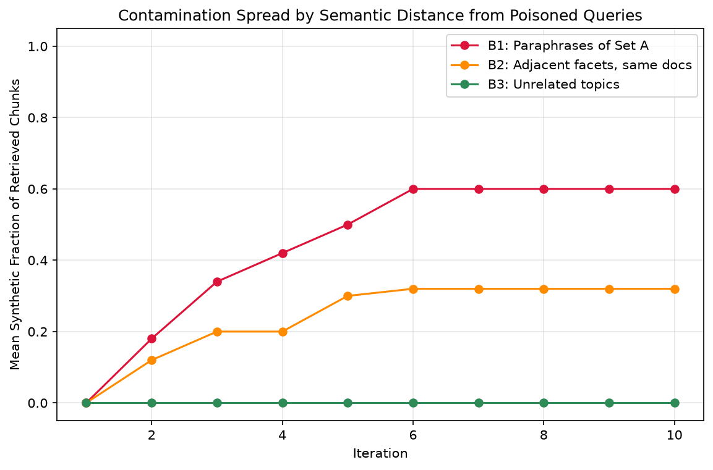

# rag-collapse-lab

## Hypothesis

RAG (Retrieval-Augmented Generation) systems that lack provenance tracking can suffer a degradation pattern sometimes called "RAG collapse" - where the system's own generated outputs get re-indexed and retrieved as if they were original source material. Over repeated cycles, this can cause answer quality to drift and synthetic content to compound, similar to model collapse in generative training.

This project reproduces that failure mode in a small, controlled RAG system, measures it quantitatively, and implements a provenance-based control that stops it, then proves the control works with a before/after comparison.

**One-sentence pitch:** I saw this break in production, so I built a lab to reproduce it, quantify it, and design the control that stops it.

## Status

Complete.

## Key Result

Contamination concentrates on queries closest to what corrupted the index. See REPORT.md for full methodology and results.

See [CONTROL.md](./CONTROL.md) for this project's provenance filter written as a formal security control statement (OWASP LLM08, NIST AI RMF).

Live endpoint: https://rag-collapse-lab.paulyohanna.workers.dev

## Reproducing this project

**Requirements:** Node.js 18+, Python 3 with matplotlib.

1. Clone the repo: `git clone https://github.com/Paul-SYD/rag-collapse-lab.git`
2. `cd rag-collapse-lab`
3. `npm install`
4. `npm run reproduce`

This verifies the live deployed system (both the unfiltered and provenance-filtered `/ask` endpoints) and regenerates the analysis charts from the commited evidence logs in `evidence/`.
 
**Note:** `npm run reproduce` is a smoke test and replot - it verifies the live deployed endpoints respond correctly and regenerates charts from the committed evidence CSVs. It does not re-run the full 10-iteration contamination experiment from scratch (that requires significant Workers AI quota and multiple sessions - see the commit history for the full session-by-session build log if you want to reproduce the raw experiment).

**Also Note:** the live endpoints depend on this project's specific Cloudflare Workers AI and Vectorize deployment. To fully redeploy your own instance, see the session-by-session build log in this repo's commit history, starting from `wrangler login`. 
 
## Non-goals

- Not trying to detect AI-generated text after the fact (unreliable - that's the point; this project tags provenance at write time instead).
- Not a production system. Toy corpus (~15 docs), small models, free tier only.
- Not claiming novelty over the 2026 "RAG collapse" literature - this is an independent small-scale replication + control demo, with citations.
 
## References

- Druck, G. & Smith, E. (2026). *RAG Collapse: [paper title as found]*. arXiv:2608.22118. https://arxiv.org/abs/2608.22118
